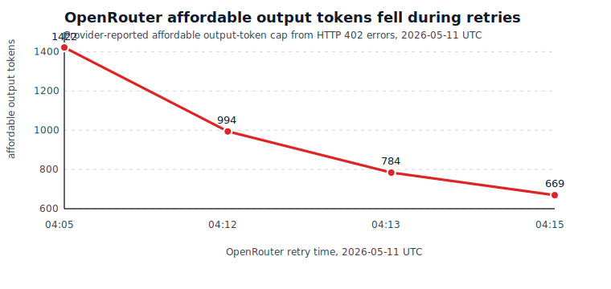

# AVO research notes

This repository is the paper/reference notebook for AVO: Agentic Variation Operators for Autonomous Evolutionary Search. It contains the original paper material, architecture notes, figures, and an experiment log tracking the implementation effort that moved into [`coder-2011/avo-ampere`](https://github.com/coder-2011/avo-ampere).

The repo is documentation-heavy by design. It is not the executable Ampere runtime. Treat it as the source of research context, design constraints, and lab notes for the AVO implementation.

## What is here

```text
paper.md                         Markdown conversion of the AVO paper
paper.pdf                        Original paper artifact
arch.md                          Architecture notes for the implementation direction
experiments.md                   Lab notebook for implementation checkpoints
Experments.md                    Earlier architecture/experiment note with typo preserved
figures/                         Paper and performance figures
pi-mono-agent                    Snapshot artifact related to the agent package
```

## Work reflected in the commit history

Recent commits show three distinct threads:

- Paper ingestion: the AVO paper was added as PDF and converted to Markdown so the design could be searched and referenced locally.
- Architecture capture: local notes and paper figures were added to preserve the implementation framing.
- Implementation notebook: `experiments.md` records the move from paper understanding to a concrete Ampere runtime, including agent-decision checks, bounded execution, baseline scoring, candidate scoring, Anthropic agent smoke tests, and CUDA-extension candidate smoke tests.

## Relationship to `avo-ampere`

`avo-ampere` is the implementation track. This repo explains why that implementation is structured the way it is:

- Ampere-only target instead of Blackwell-specific FlashAttention-4 work.
- FlashAttention-2 as the practical baseline.
- Lineage and scoring gates before autonomous mutation.
- Strict agent decisions before letting an LLM propose execution steps.
- CUDA extension smoke candidates before attempting real attention kernels.

## Current status

The research direction is active but early. The implementation has reached infrastructure readiness: it can score baseline and candidate backends, isolate failures, gate lineage, and run bounded agent decisions. It has not yet produced a novel accepted attention kernel.

## Current OpenRouter blocker

Current blocker: I do not have enough OpenRouter tokens available to keep running the Opus 4.7 long loop. The CUDA/agent loop was able to compile and score structured transforms, but the provider started returning HTTP 402 budget errors. The downward trajectory below is the provider-reported affordable output-token cap from those errors.



The chart intentionally plots only output-token limits, because those are comparable across retries. A separate prompt-token rejection also occurred at `2026-05-11T04:08:07+00:00`: the request had `27857` prompt tokens, while the provider reported only `7114` available.

| UTC time | Request | Provider-reported limit |
|---|---:|---:|
| 2026-05-11 04:05:13 | `max_tokens=4000` | `1422` affordable output tokens |
| 2026-05-11 04:08:07 | prompt tokens | `27857 > 7114` prompt-token ceiling |
| 2026-05-11 04:12:50 | `max_tokens=1200` | `994` affordable output tokens |
| 2026-05-11 04:13:37 | `max_tokens=800` | `784` affordable output tokens |
| 2026-05-11 04:15:01 | `max_tokens=700` | `669` affordable output tokens |

## Reading order

1. `paper.md` for the research proposal.
2. `arch.md` for local implementation interpretation.
3. `experiments.md` for what was actually attempted and verified.
4. `avo-ampere` for executable code.

## Known rough edges

- `Experments.md` is misspelled but retained because it is a tracked historical note.
- The repo intentionally keeps large paper/figure assets.
- The executable work lives elsewhere, so this README points out status rather than pretending this repo can run the system by itself.
